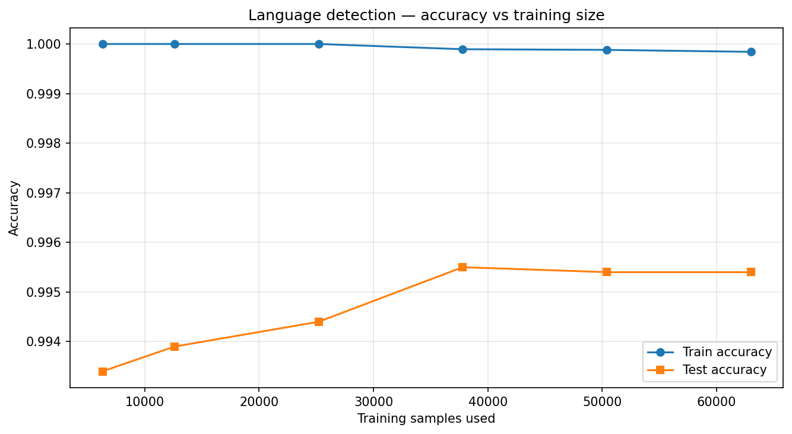
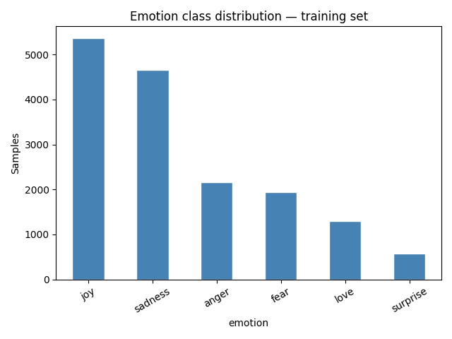
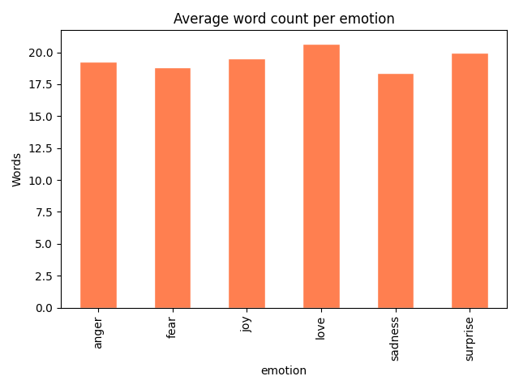
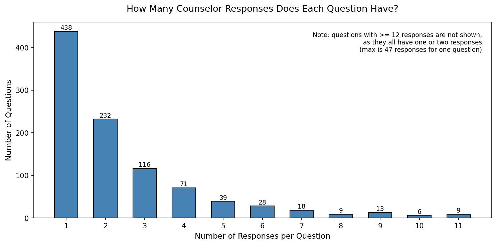
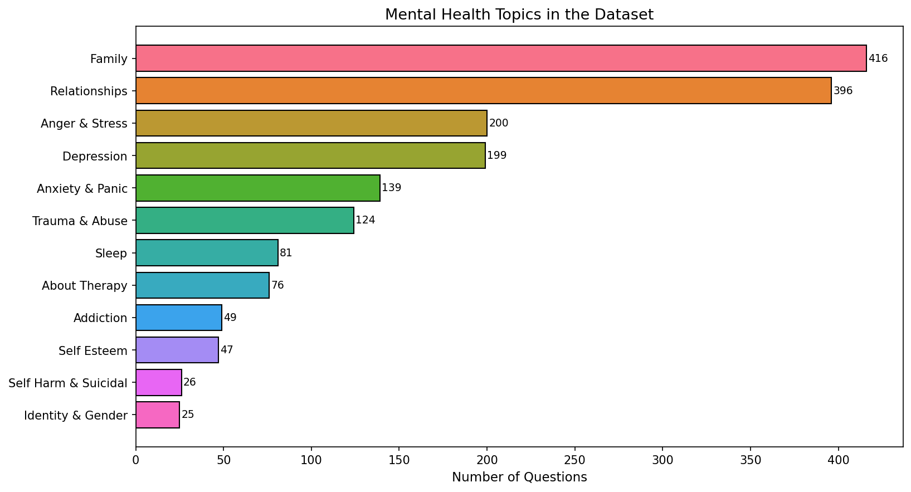

# Mental Health RAG Chatbot

A conversational AI chatbot for mental health support combining Retrieval-Augmented Generation (RAG) and advanced NLP techniques. The system understands the user's language, detects their emotional state, classifies their intent, and generates empathetic responses using a curated knowledge base of real counseling conversations.

## Team

This project was developed by:
- Mohamed Elessawy
- Abdelrahman Alshoki
- Mohamed Magdy
- A'laa Srour

## Overview

**Mental Health RAG Chatbot** is an end-to-end dialogue system designed to provide accessible mental health support. Every user message undergoes a sophisticated 4-stage pipeline: language detection → emotion analysis → intent classification → context-aware response generation. For conversational exchanges (greetings, farewells), the system responds directly. For mental health inquiries, it leverages a vector database of counseling examples to ground its responses in evidence-based practice.

---

## Architecture & Pipeline

### Data Flow

```
User Message (Streamlit UI)
    ↓
[Module 1] Language Detection (scikit-learn TF-IDF + LinearSVC)
    ↓
[Module 3] Intent Classification (LLM-based via Groq/LiteLLM)
    ↓
    ├─→ Non-RAG Intent (greeting/goodbye/gratitude)?
    │   └─→ Direct LLM Response + Metadata
    │
    └─→ Mental Health Question?
        ↓
        [Module 2] Emotion Detection (fine-tuned DistilBERT)
        ↓
        [Translation] Convert to English (if needed)
        ↓
        [RAG Module] Query Rewriting + Vector Retrieval (Qdrant)
        ↓
        [Generation] LLM Response with Context (Groq)
        ↓
        [Translation] Convert to User's Language (if needed)
        ↓
        Return Response + Metadata
    ↓
Display in Chat UI (Streamlit)
```

### Module Breakdown

**Module 1: Language Detection**
- Architecture: TF-IDF vectorizer + Linear SVC classifier
- Training dataset: [papluca/language-identification](https://huggingface.co/datasets/papluca/language-identification) (70k train, 10k test)
- Supported languages: Arabic, Bulgarian, German, Greek, English, Spanish, French, Hindi, Italian, Japanese, Dutch, Polish, Portuguese, Russian, Swahili, Thai, Turkish, Urdu, Vietnamese, Chinese (20 total)
- Performance: 99.56% test accuracy on held-out set

**Module 2: Emotion Classification**
- Architecture: Fine-tuned DistilBERT for sequence classification
- Training dataset: [dair-ai/emotion](https://huggingface.co/datasets/dair-ai/emotion) (15.9k train, 2k val, 2k test after cleaning)
- Emotion categories: Sadness, Joy, Love, Anger, Fear, Surprise (6 total)
- Performance: 88-94% accuracy depending on emotion class
- Preprocessing: Deduplication, HTML/URL removal, whitespace normalization, length filtering

**Module 3: Intent Classification**
- Architecture: Zero-shot LLM-based classification via Groq API
- Intent categories: greeting, goodbye, gratitude, follow_up, asking_mental_health_question, out_of_scope
- Context-aware: Uses conversation history to refine predictions
- Temperature: 0 (deterministic)

**Module 4: RAG Pipeline**
- Retrieval: Semantic search via SentenceTransformers (all-MiniLM-L6-v2) + Qdrant vector DB
- Query enhancement: LLM-based query rewriting to extract personal context
- Generation: LLM synthesis using top-3 retrieved documents as context
- Knowledge base: [Amod/mental_health_counseling_conversations](https://huggingface.co/datasets/Amod/mental_health_counseling_conversations) dataset

---

## Important Note for Evaluators

The `models/` directory is listed in `.gitignore` to avoid committing large model files (~135MB for language detector, ~27MB for emotion model) to the repository. **Do not be alarmed if this folder appears empty upon cloning.**

The codebase is configured to automatically download all required model weights from Google Drive on first import/run. This ensures:
1. Repository size remains lean and manageable
2. Models are always synchronized with the intended versions
3. First-time setup is seamless (just run the app)

The download process is handled transparently by `deployment/services/language_detection.py` and `deployment/services/emotion_detection.py`. Model files are cached locally after the first download.

---

## Repository Structure

```
📁 Mental-Health-RAG-Chatbot
├── 📁 deployment
│   ├── 📁 api
│   │   └── routes.py
│   ├── 📁 core
│   │   └── config.py
│   ├── 📁 schemas
│   │   ├── chat.py
│   │   └── prompts.py
│   ├── 📁 services
│   │   ├── emotion_detection.py
│   │   ├── intent_classifier.py
│   │   ├── language_detection.py
│   │   ├── rag_service.py
│   │   └── translation.py
│   ├── .env.example
│   ├── README.md
│   └── main.py
├── 📁 models (when you run the app it will look like this)
│   ├── 📁 distilbert
│   │   ├── config.json
│   │   ├── model.safetensors
│   │   ├── tokenizer.json
│   │   └── tokenizer_config.json
│   ├── .gitkeep
│   └── language_detector.joblib
├── 📁 notebooks
│   ├── module1_language_detection.ipynb
│   ├── module2_emotion_classifier.ipynb
│   ├── module3_intent_classifier.ipynb
│   └── module4_rag_pipeline.ipynb
├── 📁 outputs
│   ├── 📁 module1
│   │   ├── eda_overview.png
│   │   ├── learning_curve.png
│   │   └── test_metrics.json
│   ├── 📁 module2
│   │   ├── baseline_report.txt
│   │   ├── class_distribution.png
│   │   ├── distilbert_report.txt
│   │   └── length_per_emotion.png
│   └── 📁 module4
│       ├── responses_per_question.png
│       └── topic_distribution.png
├── .gitignore
├── README.md
├── app.py
└── requirements.txt
```

**Frontend Usage:**

The Streamlit user interface is in `app.py` at the root directory. For all setup, installation, and backend configuration instructions, see `deployment/README.md`.

---

## Results & Model Performance

### Module 1: Language Detection

**Test Set Performance (10,000 samples, 20 languages):**
- Accuracy: **99.56%**
- Best model variant: `model_2_char_only` (character n-grams only)
- Training approach: Stratified 90/10 train/validation split, model selection based on validation accuracy, final evaluation on held-out test set



The learning curve demonstrates strong generalization with minimal overfitting, even with compact character n-gram features.

### Module 2: Emotion Classification

**Validation Set Performance (2,000 samples, 6 emotions):**

| Emotion | Precision | Recall | F1-Score |
|---------|-----------|--------|----------|
| Sadness | 0.92 | 0.88 | 0.90 |
| Joy | 0.93 | 0.88 | 0.90 |
| Love | 0.75 | 0.94 | 0.84 |
| Anger | 0.88 | 0.88 | 0.88 |
| Fear | 0.83 | 0.82 | 0.83 |
| Surprise | 0.72 | 0.81 | 0.76 |
| **Overall Accuracy** | — | — | **88%** |

Fine-tuned DistilBERT significantly outperforms the TF-IDF + Logistic Regression baseline (88% vs. 88% macro F1 vs. 0.84), demonstrating the effectiveness of transformer-based emotion classification.



The dataset exhibits class imbalance (e.g., Joy: 5,359 vs. Surprise: 572), which was handled through class-weighted loss during fine-tuning.



Emotion expression varies by length; the preprocessing pipeline filtered outliers (< 3 or > 300 words) to maintain data quality.

### Module 4: RAG Pipeline

**Knowledge Base Statistics:**

- Total questions in database: Extracted from [Amod/mental_health_counseling_conversations](https://huggingface.co/datasets/Amod/mental_health_counseling_conversations)
- Topic coverage: Spans diverse mental health domains
- Retrieval method: Semantic search (all-MiniLM-L6-v2 embeddings) with Qdrant vector DB
- Top-K setting: 3 most relevant documents per query



Distribution shows multiple response variants per question, enabling diverse and contextual answer generation.



Knowledge base covers a broad spectrum of mental health topics, ensuring comprehensive support across user inquiries.
