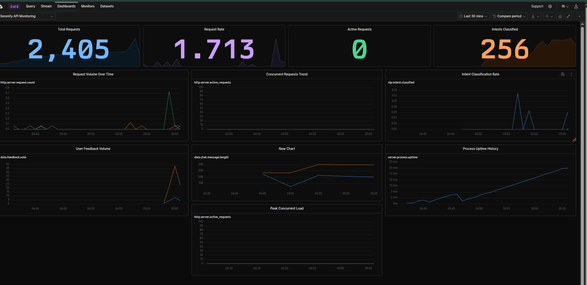

# Deployment Guide

This directory contains the production backend for the Mental Health RAG Chatbot.
It implements a FastAPI application that orchestrates the 4-module NLP pipeline
and exposes HTTP endpoints for inference.

---

## Live Deployment

The backend API is publicly accessible at:
**`https://alaasrour-serenity-backend.hf.space`**

## CI/CD Pipeline

The pipeline is defined in `.github/workflows/ci.yml` and runs automatically on every push to `main`.

### Pipeline Stages

```
push to main
     │
     ▼
1. Lint & Unit Tests  (ruff + pytest -m "not slow")
     │  slow tests require real model inference and are excluded from CI
     │  to keep the pipeline fast — run them locally with: pytest -v
     │  fails → pipeline stops
     ▼
2. Build & Push Docker Image
     │  builds linux/amd64 image, pushes to Docker Hub
     │  tags: <sha> + latest
     ▼
3. Deploy to Hugging Face Spaces
     │  git push --force → HF rebuilds the Space container
     ▼
Live at https://alaasrour-serenity-backend.hf.space
```

### Required GitHub Secrets & Variables

Go to **GitHub repo → Settings → Secrets and variables → Actions** and add:

**Secrets** (sensitive — never logged):

| Name | Description |
|------|-------------|
| `DOCKERHUB_TOKEN` | Docker Hub access token |
| `HF_TOKEN` | Hugging Face write token |

**Variables** (non-sensitive — visible in logs):

| Name | Description |
|------|-------------|
| `DOCKERHUB_USERNAME` | Your Docker Hub username |
| `HF_USERNAME` | Your Hugging Face username |
| `HF_SPACE` | Your HF Space name |


## Quick Setup

Prerequisites: Python 3.12+ and uv installed.

### 1. Install Dependencies

From the root directory of the project:

```bash
uv sync
```

For development (includes test and lint tools):

```bash
uv sync --dev
```

### 2. Configure Environment

Copy the template and fill in your API keys:

```bash
cp deployment/.env.example deployment/.env
```

Edit `deployment/.env`:

```dotenv
GROQ_API_KEY=gsk_your_key_here
QDRANT_API_KEY=your_qdrant_api_key
QDRANT_URL=https://your-cluster-id.region-0.aws.cloud.qdrant.io

INTENT_LLM_MODEL=groq/llama-3.1-8b-instant
GENERATION_LLM_MODEL=groq/openai/gpt-oss-120b

RETRIEVAL_TOP_K=3
EMBED_MODEL=all-MiniLM-L6-v2
LOG_LEVEL=INFO
ALLOWED_ORIGINS=["*"]
```

---

## Running the System

### Backend (FastAPI)

From the root directory:

```bash
uv run uvicorn deployment.main:app --reload
```

First run takes a few minutes while models download from Google Drive.

### Frontend (Streamlit)

In a separate terminal:

```bash
uv run streamlit run app.py
```

Opens at http://localhost:8501.

---

## Running with Docker

A `Dockerfile` is provided at the project root. It installs CPU-only PyTorch and
bakes the language detector and emotion model into the image at build time, so
no Google Drive download is needed at container startup.

### Build the image

From the root directory:

```bash
docker build -t mental-health-chatbot .
```

### Run the container

```bash
docker run --env-file deployment/.env -p 8000:8000 mental-health-chatbot
```

The API is then available at http://localhost:8000.

---

## Running Tests

Fast tests only (no model loading, suitable for CI):

```bash
uv run pytest -v -m "not slow"
```

All tests including real model inference:

```bash
uv run pytest -v
```

With coverage report:

```bash
uv run pytest --cov=deployment --cov-report=term-missing -v
```

---

## Pre-commit Hooks

Linting and formatting run automatically on every commit:

```bash
uv run pre-commit install
uv run pre-commit run --all-files
```

---

## Directory Structure

```
📁 deployment
├── 📁 api
│   └── routes.py
├── 📁 core
│   ├── config.py
│   └── logging.py
├── 📁 schemas
│   ├── chat.py
│   └── prompts.py
├── 📁 services
│   ├── emotion_detection.py
│   ├── intent_classifier.py
│   ├── language_detection.py
│   ├── rag_service.py
│   └── translation.py
├── 📁 tests
│   ├── conftest.py
│   ├── test_emotion_detection.py
│   ├── test_endpoints.py
│   ├── test_intent_classifier.py
│   ├── test_language_detection.py
│   ├── test_rag_service.py
│   ├── test_schemas.py
│   └── test_translation.py
├── .env.example
├── main.py
└── README.md
```

### File Descriptions

| Item | Purpose |
|------|---------|
| main.py | FastAPI entry point. Loads models on startup, configures CORS and logging. |
| api/routes.py | HTTP endpoints: /chat, /feedback, /health, /detect-language, /detect-emotion, /classify-intent. |
| core/config.py | Configuration via Pydantic BaseSettings. Loads from .env file. |
| core/logging.py | Centralized logger setup for the serenity logger hierarchy. |
| schemas/chat.py | Pydantic models: ChatRequest, ChatResponse, FeedbackRequest, FeedbackResponse. Includes input validation. |
| schemas/prompts.py | Prompt templates for intent classification, query rewriting, translation, response generation, and non-RAG replies. |
| services/language_detection.py | Language detection using a TF-IDF + LinearSVC pipeline. Auto-downloads from Google Drive. |
| services/emotion_detection.py | Emotion classification using fine-tuned DistilBERT. Auto-downloads from Google Drive. |
| services/intent_classifier.py | Intent classification via zero-shot LLM prompting through Groq. |
| services/rag_service.py | RAG pipeline: query rewriting, Qdrant retrieval, LLM response generation. |
| services/translation.py | Bidirectional translation via Groq LLM. Skips translation for English input/output. |
| tests/ | Unit and integration tests. Slow tests (real models) marked with @pytest.mark.slow. |

---

## Environment Variables

| Variable | Required | Description |
|----------|----------|-------------|
| GROQ_API_KEY | Yes | API key from console.groq.com. Used by litellm for all LLM calls. |
| QDRANT_API_KEY | Yes | API key from Qdrant Cloud. |
| QDRANT_URL | Yes | Qdrant cluster endpoint. |
| INTENT_LLM_MODEL | No | LLM for intent classification and query rewriting. Default: groq/llama-3.1-8b-instant |
| GENERATION_LLM_MODEL | No | LLM for response generation. Default: groq/openai/gpt-oss-120b |
| RETRIEVAL_TOP_K | No | Number of documents to retrieve. Default: 3 |
| EMBED_MODEL | No | Sentence embedding model. Default: all-MiniLM-L6-v2 |
| LOG_LEVEL | No | Logging verbosity. Default: INFO |
| ALLOWED_ORIGINS | No | CORS allowed origins list. Default: ["*"] |

---

## API Endpoints

Interactive API explorer available at http://127.0.0.1:8000/docs when the backend is running.

### GET /health

Returns service status and whether all models are loaded.

```json
{"status": "healthy", "models_loaded": true}
```

### POST /chat

Main endpoint. Accepts a message, runs the full pipeline, returns a response.

Request:
```json
{
  "message": "I have been feeling very sad lately. What should I do?",
  "history": []
}
```

Response:
```json
{
  "intent": "asking_mental_health_question",
  "emotion": "sadness",
  "language": "en",
  "response": "I hear you. Sadness is a natural emotion...",
  "retrieved_documents": true
}
```

### POST /feedback

Accepts user feedback on bot responses. Used by the frontend thumbs up/down buttons.

Request:
```json
{
  "vote": "up",
  "user_message": "I feel anxious",
  "bot_response": "I hear you..."
}
```

Response:
```json
{"status": "ok"}
```

### POST /detect-language

```json
{"message": "Bonjour, comment allez-vous?", "history": []}
```

Response: `{"language": "fr"}`

### POST /detect-emotion

```json
{"message": "I am feeling really overwhelmed and anxious today.", "history": []}
```

Response: `{"emotion": "fear"}`

### POST /classify-intent

```json
{"message": "What can I do about my depression?", "history": []}
```

Response: `{"intent": "asking_mental_health_question"}`

---

## System Monitoring

The API is instrumented with [OpenTelemetry](https://opentelemetry.io/) and exports traces, metrics, and logs directly to [Axiom](https://axiom.co). See [monitoring/README.md](monitoring/README.md) for full setup.

Add to `deployment/.env`:

```dotenv
OTEL_ENABLED=true
AXIOM_TOKEN=your_axiom_api_token
```

Run the instrumented API:

```bash
uvicorn deployment.main_otel:app --reload
```

### Three chosen metrics and reasoning

| # | Category | Metric | Recorded when | Why we track it |
|---|----------|--------|---------------|-----------------|
| 1 | **Model / NLP** | `nlp.intent.classified` | After intent classification on `/chat` | Shows user intent distribution; spikes in `out_of_scope` may indicate prompt issues or misuse |
| 2 | **Data** | `data.chat.message.length` | On every `/chat` request | Detects abnormal input sizes (very short bot-like messages or very long abuse/injection attempts) |
| 3 | **Server** | `http.server.request.count` | On every HTTP request via middleware | Tracks request volume; `http.status_code` attribute enables per-route error rate |

Additional signals: `data.feedback.vote` (thumbs up/down), `http.server.request.duration`, `server.process.uptime`.

### Axiom dashboard



| Panel | Metric | Category | Why we track it |
|-------|--------|----------|-----------------|
| Intent Classification Rate | `nlp.intent.classified` | Model / NLP | How users interact with the bot |
| Message Length | `data.chat.message.length` | Data | Input quality and abuse detection |
| Request Volume Over Time | `http.server.request.count` | Server | Load and availability |
| User Feedback Volume | `data.feedback.vote` | Data | Response satisfaction |
| Concurrent Requests Trend | `http.server.active_requests` | Server | Live concurrency |
| Process Uptime History | `server.process.uptime` | Server | Service health |

MPL dashboard queries: [monitoring/axiom-dashboard-queries.txt](monitoring/axiom-dashboard-queries.txt)
