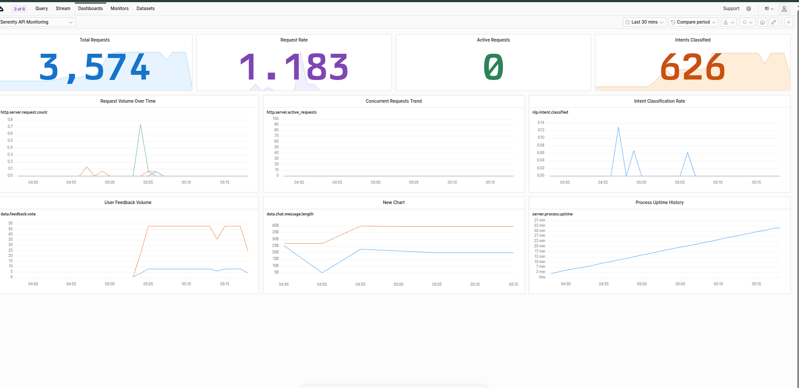

# OpenTelemetry Monitoring

OpenTelemetry-based API monitoring for the Serenity Mental Health Chatbot. Exports traces, metrics, and logs directly to [Axiom](https://axiom.co) via OTLP/HTTP.

Instrumentation lives in `deployment/monitoring/` and is activated via `deployment/main_otel.py` (or `deployment.main:app`, which also calls `instrument_app()`).

## Architecture

```
FastAPI (main_otel.py or main.py)
  │  OTLP/HTTP + AXIOM_TOKEN from deployment/.env
  ▼
Axiom
  ├── serenity-traces   (HTTP spans, LLM/Qdrant outbound calls)
  ├── serenity-metrics  (custom + auto HTTP metrics)
  └── serenity-logs     (application logs with trace correlation)
```

No Docker or OpenTelemetry Collector is required for local development.

## Chosen metrics

Three primary metrics — one per assignment category — drive the Axiom dashboard:

| Category | Metric | Type | Why we track it |
|----------|--------|------|-----------------|
| **Model / NLP** | `nlp.intent.classified` | Counter | Shows how users interact (greetings vs mental-health questions vs out-of-scope) and flags unusual intent spikes |
| **Data** | `data.chat.message.length` | Histogram | Surfaces very short or very long inputs that may indicate abuse, injection attempts, or UX issues |
| **Server** | `http.server.request.count` | Counter | Tracks request volume and error rate via `http.status_code` labels |

Supporting metrics:

| Metric | Type | Purpose |
|--------|------|---------|
| `data.feedback.vote` | Counter | Thumbs up/down on bot responses |
| `http.server.request.duration` | Histogram | Per-route latency |
| `http.server.active_requests` | UpDownCounter | Live concurrency |
| `server.process.uptime` | Observable gauge | Process availability |

## Setup

### 1. Configure Axiom in `deployment/.env`

```dotenv
OTEL_ENABLED=true
AXIOM_TOKEN=your_axiom_api_token
OTEL_SERVICE_NAME=serenity-mental-health-api
OTEL_SERVICE_VERSION=0.1.0
OTEL_DEPLOYMENT_ENVIRONMENT=development
```

`AXIOM_TOKEN` alone builds all OTLP endpoints and auth headers. You do **not** need to set `OTEL_EXPORTER_OTLP_*_ENDPOINT` for Axiom.

Create three datasets in Axiom (or rename via env vars):

| Env var | Default dataset |
|---------|-----------------|
| `AXIOM_TRACES_DATASET` | `serenity-traces` |
| `AXIOM_METRICS_DATASET` | `serenity-metrics` |
| `AXIOM_LOGS_DATASET` | `serenity-logs` |

### 2. Install dependencies

```bash
uv sync
# or: pip install -r requirements.txt
```

### 3. Run the instrumented API

```bash
uvicorn deployment.main_otel:app --reload
```

The original entry point also works (instrumentation is wired in `main.py`):

```bash
uvicorn deployment.main:app --reload
```

On success you should see:

```
OpenTelemetry monitoring enabled for service=serenity-mental-health-api
```

## Axiom dashboard



Panels cover all three assignment metrics (NLP, data, server) plus supporting signals. Add panels in Axiom using MPL queries from [axiom-dashboard-queries.txt](axiom-dashboard-queries.txt).

| Panel | Metric | MPL query # |
|-------|--------|-------------|
| Intent Classification Rate | `nlp.intent.classified` | 1 |
| Message Length | `data.chat.message.length` | 2 |
| Request Volume Over Time | `http.server.request.count` | 3 |
| User Feedback Volume | `data.feedback.vote` | 5 |
| Concurrent Requests / Peak Load | `http.server.active_requests` | 8 |
| Process Uptime History | `server.process.uptime` | 9 |

**Note:** Histogram metrics (`data.chat.message.length`) use `bucket` in MPL, not `avg(value)`. Counters use `align` / `group using sum`.

## Environment variables

| Variable | Required | Default | Description |
|----------|----------|---------|-------------|
| `OTEL_ENABLED` | No | `true` | Set `false` to disable export |
| `AXIOM_TOKEN` | Yes* | — | Axiom API token; auto-configures endpoints and headers |
| `AXIOM_TRACES_DATASET` | No | `serenity-traces` | Traces dataset name |
| `AXIOM_METRICS_DATASET` | No | `serenity-metrics` | Metrics dataset name |
| `AXIOM_LOGS_DATASET` | No | `serenity-logs` | Logs dataset name |
| `OTEL_EXPORTER_OTLP_ENDPOINT` | No | — | Generic OTLP base URL (non-Axiom backends) |
| `OTEL_EXPORTER_OTLP_*_ENDPOINT` | No | — | Per-signal override |
| `OTEL_EXPORTER_OTLP_*_HEADERS` | No | — | Per-signal headers (`key=value,key2=value2`) |
| `OTEL_SERVICE_NAME` | No | `serenity-mental-health-api` | Service name in telemetry |
| `OTEL_SERVICE_VERSION` | No | `0.1.0` | Service version |
| `OTEL_DEPLOYMENT_ENVIRONMENT` | No | `development` | Deployment environment label |

\* Either `AXIOM_TOKEN` or at least one OTLP endpoint must be set.

## File layout

```
deployment/main.py          ← FastAPI app (also calls instrument_app)
deployment/main_otel.py     ← dedicated instrumented entry point
deployment/monitoring/
  ├── app_metrics.py        ← NLP, data, uptime metrics
  ├── config.py             ← OTEL + AXIOM env settings
  ├── otel.py               ← OTLP exporters
  ├── middleware.py         ← HTTP request metrics
  ├── instrument.py         ← wires everything together
  ├── axiom-dashboard-queries.txt
  └── dashboard/dashboard.png
```

## Disabling monitoring

- Set `OTEL_ENABLED=false`, or remove `AXIOM_TOKEN` and all OTLP endpoints
- Run without instrumentation: ensure `OTEL_ENABLED=false` in `.env`
